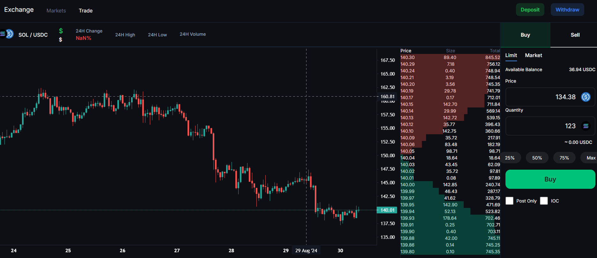
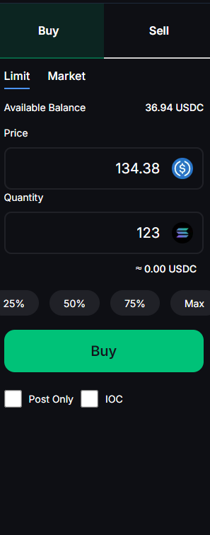
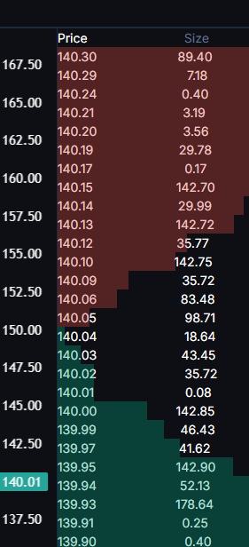
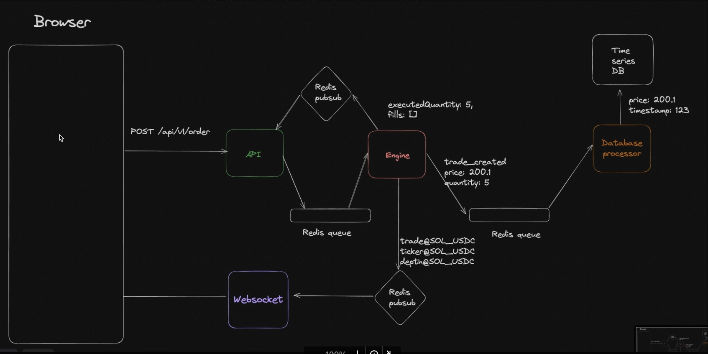

# Exchange Platform

## Overview

A comprehensive trading platform for real-time trading and market data visualization. This project includes both frontend and backend components to manage trades, orderbooks, and market data efficiently.

**Technologies Used:**
- Frontend: Next.js
- Backend: Node.js, Express
- Database: Redis, TimescaleDB

## Architecture

1. **API Server**: Manages HTTP requests.
2. **Engine**: Handles orderbooks and user balances in memory.
3. **WebSocket Server**: Streams real-time updates.
4. **DB Processor**: Stores data in the database.
5. **Frontend**: Built with Next.js.
6. **Market Maker**: Maintains liquidity.
7. **Redis**: Manages queue and pub/sub operations.
8. **TimescaleDB**: Handles time-series data.

## Project Screenshots

Here are some screenshots of the project:






## Project Setup

To set up and run the project locally, follow these steps:

### Prerequisites

Make sure you have **Node.js** and **Redis** installed on your machine.

### Installation

1. Clone the repository:
   ```bash
   git clone <repository-url>
